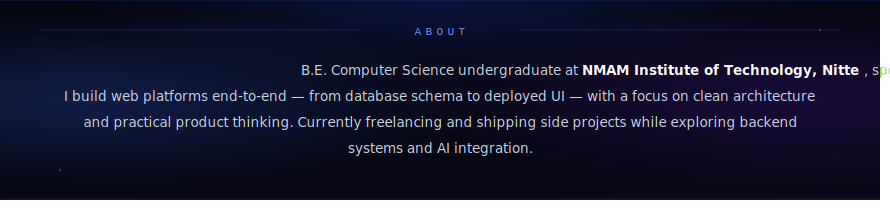

<!-- HEADER -->

<!-- ABOUT -->

  
  &nbsp;
  
  &nbsp;
  

---

<!-- TECH STACK -->

 

---

<!-- PROJECTS -->

<table width="100%">
<tr>
<td width="50%" valign="top">

#### Forza Team &nbsp;`2025–Present`
Multi-tenant sports club management web platform — teams, rosters, schedules, and RBAC across organisations. Mobile app in active development.

    

</td>
<td width="50%" valign="top">

#### CareerAI &nbsp;`June 2026`
AI-powered career copilot — resume parsing, job matching, interview prep. Core AI & Intelligence member on a 9-person team.

   

</td>
</tr>
<tr>
<td width="50%" valign="top">

#### LoanSage &nbsp;`March 2025`
Multilingual conversational loan advisor with voice support and blockchain verification. **Top 150 / 1,500** at Great Bengaluru Hackathon 2025.

  

</td>
<td width="50%" valign="top">

#### KarmaProps &nbsp;`2026`
Full-stack AI SMS platform for property management — LLM agent auto-generates contextual replies with human-in-the-loop approval and a WhatsApp-style dashboard.

   

</td>
</tr>
</table>

---

<!-- CERTIFICATIONS -->

 

&nbsp;

 

&nbsp;

---

<!-- STATS + GRAPH -->

<table>
<tr>
  <td align="center">
    
  </td>
  <td align="center">
    
  </td>
</tr>
</table>

 

---

  Consistency is what transforms average into excellence.

